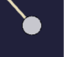
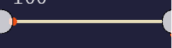
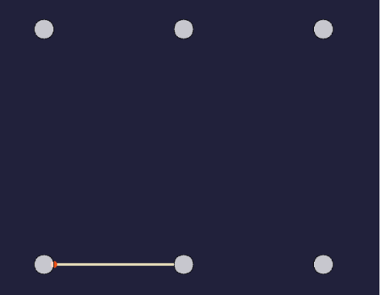
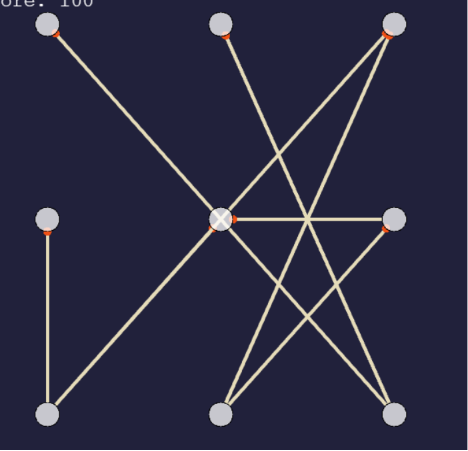
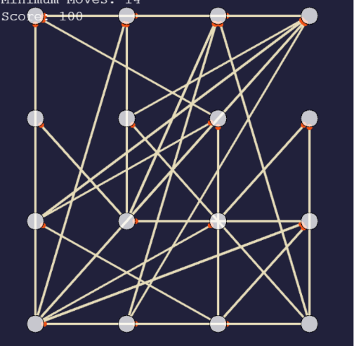
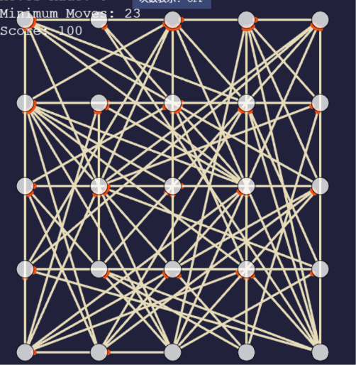
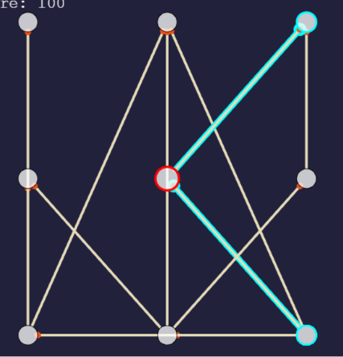
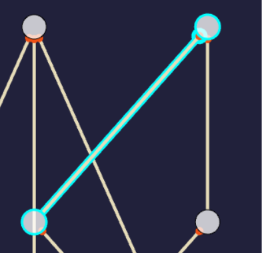
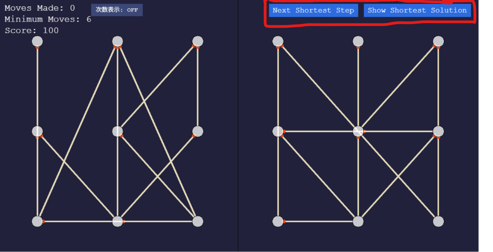

# マッチ棒パズルGI

[遊ぶ](https://manybear-a1.github.io/match-puzzle-gi/src/games/graphisomorphism/index.html)

マッチ棒パズル（の変種）です。マッチ棒そのものを動かす代わりにマッチ棒がくっついている頂点を動かします。

<video width="50%" src="./img/gameplay.mp4" controls></video>
# ルール

## ざっくりとしたルール

このマッチ棒パズルではマッチ棒を直接動かすことはできません。代わりに、マッチ棒と繋がっている白い丸（関節みたいなもの）を動かして操作します。

白い丸（関節）

関節の置ける位置は決まっていて、それぞれの位置に関節が一つだけ入ります。関節をドラッグ＆ドロップすることで二つの関節の位置を入れ替えられるので、入れ替えを繰り返してマッチ棒のパターンを作ってください。

マッチ棒
## ざっくりとしたルール２（わかる人向け）

できる限り少ない数の互換を合成して二つのグラフの間の同型射を構成してください。
## 厳密なルール

画面右半分のマッチ棒で作られているパターンを画面左半分のマッチを使って作ってください。

ただし、通常のマッチ棒パズルのルールに加えて、以下の条件が追加されています。

- 各マッチ棒はちょうど二つの異なる頂点（白丸）と結びついており、また各頂点には結びついているマッチ棒の数が表示されます。また、同じ頂点の組に結びついているマッチ棒は高々一本しか存在しないことが保証されます。

- あなたができる操作は二つの頂点を交換することだけです。具体的には、交換したい頂点のうちの一つを選び、その頂点を左クリックしたのちもう一つの頂点までドラッグして離すことにより交換できます。この交換によって、交換した二つの頂点に結びついているマッチ棒の片側の位置も交換後の位置に移動されます。

- マッチ棒の長さは自動的に調整されます。マッチ棒の頭の向きは無視します。

このパズルは必ず解をもつようにランダムに生成されます。（盤面の生成確率はおそらく等確率ではありません。生成コードは（[ここ](./puzzlegenerator/puzzlegenerator.ts)にあります）このゲームの目標は最小の交換回数で同じパターンを作ることです。

スコアは今のところEasyとNormalにしかありません。EasyとNormalにおいては、スコアは最小の交換回数/あなたが頂点を交換した回数 * 100で計算されます。最大で100点です。
# その他機能
- 難易度設定

  Easy, Normal, Hard, Impossibleの四つ。

  Easy 
  
  Normal 
  
  Hard 
  
  Impossible

  それぞれ盤面のサイズがEasyが2x3頂点、Normalが3x3頂点、Hardが4x4頂点、Impossibleが5x5頂点となっている。

 
- ハイライト機能
  
  関節の上にポインタをホバーさせることでその関節と、関節に直接繋がっているマッチ棒をハイライトできる。

  関節に直接繋がっているマッチ棒のハイライト

  位置が確定している関節を右クリックすることで固定することができ、固定された関節は青色になる。

  固定された関節

  マッチ棒の上にポインタをホバーさせることでそのマッチ棒と、マッチ棒に直接繋がっている関節をハイライトできる。

  マッチ棒に直接繋がっている関節のハイライト
- 解答機能
  
  EasyとNormal、およびHardとImpossibleの一部の問題では、最短手数の計算表示機能が利用でき、ヒントや解答として利用できる。
  
  右上の「Show Shortest Solution」を押すことで、最短手数の解答を表示するモードに切り替わる。「Show Shortest Solution」の左の「Next Shortest Step」ボタンを押すことで、現在の盤面から始めた最短手数の解答の次の手順をコンピューターに代わりに操作してもらうことができる。

  解答表示ボタンの位置

  解答表示場面では、「Replay From Start」ボタンを押すことで、最初から順番に解答の手順を表示することができ、またその下のシークバーを動かすことで途中までの解答を表示することができる。問題によっては手順ごとの考え方が表示される場合がある。

  <video width="50%" src="./img/solution.mp4" controls></video>

  このパズルに備わっているパズルソルバーは[戦略](./editorial/strategy.md)に基づいて実装されている。

# TODO（やりたいこと）

- 無限に続けられるモード(Infinity)の追加
  
  下からどんどんマッチ棒が出てくるみたいな。

- パズル生成の改良
  
  現在は完全ランダム（各辺が30%で出現する）に生成しているため、盤面ごとの難易度のぶれ幅が大きい。生成後の盤面のシャッフルも改良する必要があるかもしれない。（例えば攪乱順列にするとか）

- （自動）テスト
  
  特にアルゴリズム関連のテストが必要。

- チュートリアル
  
  パズルの遊び方の説明を追加する。

- 戦略、アルゴリズム等の解説、証明
  
  草案は[ここ](./editorial/strategy.pdf)にあります。このPDFのソースは[ここ](./editorial/strategy.typ)にあります。